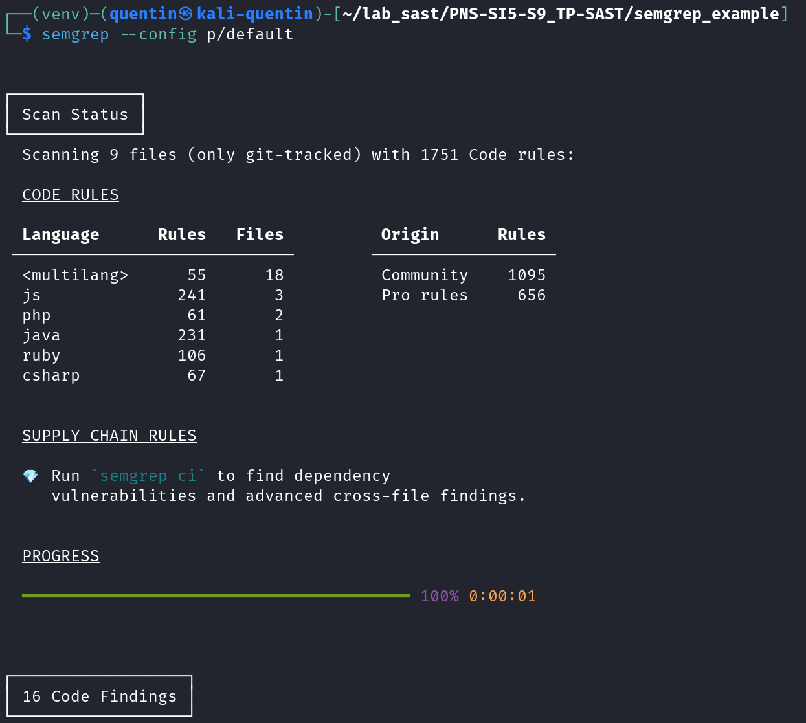
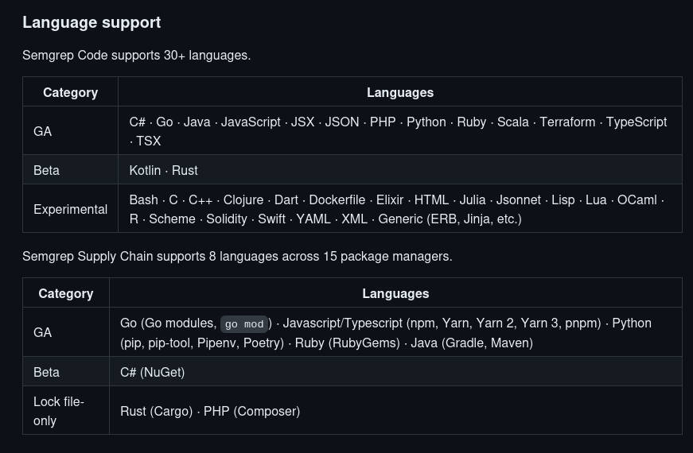
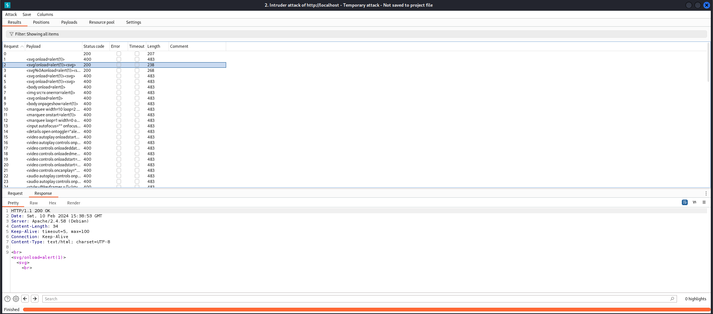

Toutes les modifications apportées au projet fourni dans le TD sont disponibles sur GitHub : [QuentinDubois-Polytech/PNS-SI5-S9_TP-SAST (github.com)](https://github.com/QuentinDubois-Polytech/PNS-SI5-S9_TP-SAST)

# Exercice 1

**Vous devez analyser les 5 scripts Python contenus dans le dossier `ex_1` de la manière suivante :**

- **Commencez par faire un scan Bandit sans préciser de fichier de configuration et sauvegardez ce premier rapport aux formats html et text.**
- **Étudiez ce rapport et lorsque vous pensez avoir trouvé quelle vulnérabilité est contenue dans chacun des 5 scripts, générez un nouveau fichier de configuration ne contenant que le module associé à cette vulnérabilité. Sauvez votre rapport aux formats html et texte**

Nous allons tout d'abord trouver les différentes options de la commande `bandit`, qui nous serons utiles par la suite, à l'aide de la commande `bandit --help`. Nous trouvons les options suivantes :

- `-r <path>` : recherche et traite les fichiers et les sous-répertoires
- `-c <config_file>` : fichier de configuration optionnel à utiliser pour sélectionner les plugins et modifier les valeurs par défaut
- `-f {csv,custom,html,json,screen,txt,xml,yaml}` : spécifie le format de sortie
- `-o <output_file>` : écrit le rapport dans le fichier

Pour générer les rapports au format html et au format texte, sur l'ensemble des scripts du dossier `ex_1`, nous allons exécuter les commandes suivantes, au niveau du dossier racine du projet GitHub.

```bash
bandit -r ex_1 -o ex_1/reports/scan_bandit_global_ex_1.html -f html
```

```bash
bandit -r ex_1 -o ex_1/reports/scan_bandit_global_ex_1.txt -f txt
```

Après l'exécution des deux commandes ci-dessus, les deux rapports sont disponibles dans le dossier `ex_1/reports`. Ils sont actuellement disponibles dans le dépôt GitHub du projet dans le dossier `ex_1/reports`.

Nous allons maintenant adapter le fichier de configuration par défaut de `bandit` pour chaque script du dossier `ex_1`, contenant uniquement les tests identifiant des vulnérabilités.

Nous allons tout d'abord générer, le fichier de configuration de `bandit` à l'aide la commande suivante, que nous utiliserons comme template par la suite :

```bash
bandit-config-generator -o ex_1/configs/default-config.yml
```

Après analyse du fichier de configuration et de la documentation officielle de Bandit ([Configuration — Bandit documentation](https://bandit.readthedocs.io/en/latest/config.html)), nous trouvons que pour exécuter seulement les tests spécifiés par l'utilisateur, il faut spécifier les identifiants des tests dans le champ `tests` de la configuration sous forme d'une liste.

<!--TODO : modifier avec le django (pas français)-->

Prenons l'exemple pour le script `1.py` présent dans le dossier `ex_1`. Ce script est vulnérable au SQLI (SQL Injection) dans son utilisation de `django`. Ce type de vulnérabilité est analysé par le module de Bandit appelé "django_extra_used" qui possède l'identifiant : "B610". Il faut donc modifier le champ `tests` de la configuration associé au script `1.py` de la manière suivante :

```bash
tests: [B610]
```

La configuration spécifique au script est disponible dans le dossier `ex_1/configs`, comme l'ensemble des configurations de Bandit pour les autres scripts. Il faut ensuite générer de nouveaux rapports en précisant le fichier de configuration dans la commande `bandit`, à l'aide de l'option `-c`. Ainsi, pour l'exemple du script `1.py`, la commande à exécuter est la suivante :

```bash
bandit -r ex_1/1.py -c ex_1/configs/config-1.yml -o ex_1/reports/1/scan_bandit_1.html -f html
```

Nous générons ensuite le même rapport au format texte.

Nous allons brièvement évoquer les tests à exécuter pour les autre scripts :

- `2.py` : B102
- `3.py` : B105, B106, B107
- `4.py` : B310
- `5.py` : B608

Nous réalisons ensuite les mêmes opérations décrites ci-dessus sur l'ensemble des scripts restants. Les configurations `bandit` des scripts sont définies dans le dossier `ex_1/configs`, l'ensemble des rapports sont disponibles dans le dossier `ex_1/reports`.

# Exercice 2

Nous avons tout d'abord installé et configuré `semgrep`, en suivant la documentation suivante : [Quickstart | Semgrep](https://semgrep.dev/docs/getting-started/quickstart/).

Afin de vérifier l'installation, nous scannons le dossier `semgrep_example`, Nous obtenons finalement le même résultat que sur le sujet du TD.



**Vous allez maintenant utiliser Semgrep afin d’auditer les différentes applications du dossier `ex_2`. Pour chacun des dossiers vous devez :**

- **Réaliser un scan complet de l’application**
- **Identifier les vulnérabilités High**
- **Corriger ces vulnérabilités**
- **Réaliser à nouveau un scan afin de vérifier votre correction**

Pour réaliser un scan complet de l'application dans le dossier `ex_2`, nous allons exécuter la commande suivante, à partir du dossier `ex_2` du projet GitHub :

```bash
semgrep ci
```

Après la complétion du scan, nous nous rendons dans la dashboard du projet sur le site de Semgrep. Nous pouvons consulter le résultat du scan.


Nous trouvons finalement 3 vulnérabilités de sévérité "High" toutes présentes dans la première application située dans le dossier `exo_2/1`. Toutes les vulnérabilités sont en lien avec la configuration du parseur XML de l'application.

Nous allons tout d'abord commencer par corriger les vulnérabilités : "**xml-external-entities-unsafe-entity-loader**" et "**xml-external-entities-unsafe-parser-flags**" présentent dans le fichier `test.php`.  
Pour résoudre ces vulnérabilités, il faut modifier les lignes suivantes dans le code du fichier :

```php
libxml_disable_entity_loader(true); // line 7 / fix : xml-external-entities-unsafe-entity-loader
$document->loadXML($xml, LIBXML_DTDLOAD); // line 12 / fix : xml-external-entities-unsafe-parser-flags
```

Nous allons désormais corriger la vulnérabilité, "**xml-dtd-allowed**" présent dans le fichier `XmlReader_Test.cs`. Pour cela, il faut modifier le code de la manière suivante, afin de désactiver le parsing des dtd :

```cs
settings.DtdProcessing = DtdProcessing.Ignore; // line 19 / fix : xml-dtd-allowed
```

Finalement, nous relançons le scan du dossier `ex_2` du projet pour vérifier la bonne correction des vulnérabilités.


# Exercice 3

**Auditez l’application contenue dans le dossier ‘ex_3’, corrigez les vulnérabilités High détectées et vérifiez vos corrections avec un scan de contrôle.**

Nous allons tout d'abord exécuter un scan avec Semgrep sur le dossier `ex_3` du projet GitHub.


Nous trouvons finalement 7 vulnérabilités de sévérité "High" présentent dans le dossier `ex_2` provenant des types de vulnérabilités suivantes : "**sqlachemy-execute-raw-query**" et "**avoid_hardcoded_config_SECRET_KEY**".

Nous allons commencer par résoudre les vulnérabilités de type "**sqlachemy-execute-raw-query**". Cette vulnérabilité provient de la concaténation d'entrées non fiables avec le code de requêtes SQL. Pour résoudre cette vulnérabilité, nous allons utiliser des requêtes préparées. Il faut modifier toutes les lignes de code des fichiers ci-dessous, pour éliminer la présence de cette vulnérabilité dans le dossier `ex_3`.

```python
# db_initi.py
c.execute("INSERT INTO users (username, password, failures, mfa_enabled, mfa_secret) VALUES (?, ?, ?, ?, ?)", (u, p, 0, 0, '')) # line 20
```

```python
# db.py
c.execute("INSERT INTO users (user, password, failures) VALUES (?, ?, ?)", (u, p, 0)) # line 19
```

```python
# libuser.py
user = c.execute("SELECT * FROM users WHERE username = ? and password = ?", (username, password)) # line 12

c.execute("INSERT INTO users (username, password, failures, mfa_enabled, mfa_secret) VALUES (?, ?, ?, ?, ?)", (username, password, 0, 0, '')) # line 25

c.execute("UPDATE users SET password = ? WHERE username = ?", (password, username)) # line 53
```

Nous allons maintenant résoudre les vulnérabilités de type "**avoid_hardcoded_config_SECRET_KEY**". Cette vulnérabilité provient de la présence de variables nommées "SECRET_KEY" hardcodés dans le code de l'application. Nous allons initialiser ces variables en utilisant le fichier de configuration `secret.conf` dont nous placerons le chemin dans `.gitignore`, pour qu'il ne soit pas envoyé sur le dépôt de code distant par erreur. Nous avons besoin de modifier de modifier les fichiers `vulpy-ssl.py` et `vulpy.py`, pour éliminer la présence de cette vulnérabilité dans notre projet, de la manière suivante.

```python
import configparser

config = configparser.ConfigParser()
config.read('secret.conf')
section_default = config['DEFAULT']

app.config['SECRET_KEY'] = section_default["SECRET_KEY"]
# app.config['SECRET_KEY'] = 'aaaaaaa' (remplacer par les lignes precedentes)
```

Notre fichier `secret.conf` se situent dans le dossier `ex_3` et il contient les données suivantes :

```conf
[DEFAULT]
SECRET_KEY = aaaaaaa
```

Finalement, nous relançons le scan du dossier `ex_2` du projet, afin de vérifier la bonne correction des vulnérabilités.


# Exercice 4

**Les SAST comme Semgrep permettent d’identifier rapidement un certain nombre de vulnérabilités dans un code. Cependant, certaines failles leur échappent du fait qu’elles ne peuvent s’identifier qu’au runtime avec des DAST. Pour ce dernier exercice, vous devez fournir un code contenant une vulnérabilité de votre choix qui n’est détectable qu’avec une analyse dynamique, réalisée avec un DAST. Les documents attendus sont :**

- **Le code vulnérable ainsi que tous les fichiers nécessaires pour lancer l’application.**
- **Le rapport de Semgrep**
- **Des captures d’écran de la détection de la vulnérabilité par un DAST (Burp, Zap…)**
- **Une courte explication de la vulnérabilité ainsi que les raisons de sa non détection par un SAST**

Nous allons nous intéresser à la vulnérabilité Web, XSS (Cross-site Scipting). Cette faille de sécurité fait partie des vulnérabilités de type "Code Injection". Elle consiste à injecter du code Javascript dans une entrée utilisateur d'une application web. Si l'application est vulnérable l'entrée utilisateur sera convertie en code et exécutée dans l'application Web. Il existe 3 types de XSS : Reflected, Stored et DOM. Nous allons dans la suite nous concentrer, sur la plus simple et la plus ancienne, la XSS Reflected. Si Semgrep ne parvient pas à détecter celle-ci, nous sommes optimistes quant à son incapacité à détecter les autres types.

Tout d'abord les langages Javascript et PHP sont supportés par Semgrep, comme vous pouvez le voir sur la capture d'écran ci-dessous.



Notre application vulnérable est composée de deux fichiers : `ex_4/guestbook.php` et `ex_4/guestbookleavemessage.php`. Le premier `guestbook.php` permet à un utilisateur de pouvoir entrer un message qui sera ensuite envoyé au script `guestbookleavemessage.php`, la réponse du serveur est incorporée dans une balise `div` de la page Web, permettant à l'utilisateur de consulter la réponse du serveur. Le script `guestbookleavemessage.php` renvoie simplement l'entrée de l'utilisateur. La réponse dans le script `guestbook.php` est injectée dans la page de manière non sécurisée, en utilisant la propriété `innerHTML` d'un élément HTML `div` utilisé à cette effigie.

L'un des payload dont l'application est vulnérable est par exemple, `` dans l'input présent dans le script `guestbook.php`.

Nous allons tout d'abord commencer par analyser notre application vulnérable avec Semgrep, afin de vérifier, si elle est bien non détectée.


Dans les résultats de l'analyse, nous trouvons aucune vulnérabilité détectée par SemGrep. Nous allons maintenant utiliser l'outil Burp, afin de vérifier s'il peut détecter la vulnérabilité automatiquement. Nous allons tout d'abord intercepter la requête envoyée du client au serveur pour contacter le script `guestbookleavemessage.php`. Nous allons ensuite utiliser l'outil "Intruder" pour tester automatiquement un ensemble de payload XSS. Nous spécifions que nous voulons incorporer les payloads sur le paramètre `message`. Pour notre jeu de données, ainsi que pour réaliser cette analyse avec Burp, nous avons utilisé l'article de blog suivant : [A Brief XSS Scanning with Burp Suite | by Andrey Enin | Medium](https://adequatica.medium.com/a-brief-xss-scanning-with-burp-suite-ff136bc55238).



Nous remarquons que les différents réponses possèdent 2 codes différents, le 200 et le 400. Dans le cas du code 400, c'est simplement que le paramètre donné est invalide et a donc causé une erreur côté serveur (notamment les espaces qui ne sont pas compréhensibles dans une url). Cependant dans le cas des codes 200, nous pouvons remarquer que la réponse aux requêtes contient exactement la valeur spécifiée dans le paramètre `message` de la requête sans aucune modification, même pour les tags et paramètres dangereux. Ce qui nous permet donc d'effectuer des attaques XSS reflected. Nous pouvons ainsi aisément détecter la vulnérabilité, de plus aucun traitement n'est également présent côté client.

Nous pensons que Semgrep est dans l'incapacité de détecter la vulnérabilité XSS Reflected, car il ne peut pas exécuter le code et donc relever le lien entre les deux scripts. La vulnérabilité provient de la combinaison des deux scripts, détectable uniquement en exécutant l'application.
